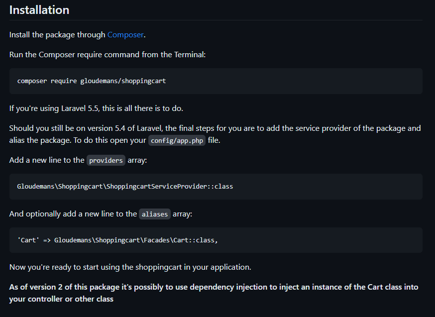

# 7.Designing Shopping Cart

## [Laravel Shopping cart package ](https://github.com/olimortimer/LaravelShoppingcart)

### installation

```php
composer require olimortimer/laravelshoppingcart
```

### copy this code and paste in the providers array `config\app.php`

```php
Gloudemans\Shoppingcart\ShoppingcartServiceProvider::class
```

### copy this code and paste this in the aliases array `config\app.php`

```php
'Cart' => Gloudemans\Shoppingcart\Facades\Cart::class,
```

<hr/>

# cart add and remove

## we will use the package `Laravel shopping cart `

### [Click ME See the package](https://github.com/Crinsane/LaravelShoppingcart)



### this is the routing code

```php
Route::get('/view_cart', '\App\Http\Controllers\ProductController@viewCart');
Route::get('/remove_item/{rowId}', '\App\Http\Controllers\ProductController@removeItem');
```

### This is the cart controller code

```php
// ------------------ add cart function -------------------
public function addToCart(Request $request){
    $id = $request->has('pid')? $request->get('pid') : '';
    $name = $request->has('name')? $request->get('name') : '';
    $quantity = $request->has('quantity')? $request->get('quantity') : '';
    $size = $request->has('size')? $request->get('size') : '';
    $price = $request->has('price')? $request->get('price') : '';

    $images = Product::find($id)->image;
    $image = explode('|', $images)[0];

    $cart = Cart::content()->where('id', $id)->first();
    if (isset($cart) && $cart != null){
        $quantity = ((int)$quantity * (int)$cart->qty);
        $total = ((int)$quantity * (int)$price);
        Cart::update($cart->rowId,['qty'=>$quantity, 'options' => ['size'=> $size, 'image'=>$image, 'total'=>$total]]);
    } else {
        $total = ((int) $quantity * (int)$price);
        Cart::add($id, $name, $quantity, $price, ['size'=> $size, 'image'=>$image, 'total'=>$total]);
    }

    return redirect('/shop')->with('success', 'Product added to your cart!');
}
// ------------------ view Cart function -------------------
public function viewCart(){
    $carts = Cart::content();
    $subTotal = Cart::subtotal();
    return view('cart.cart', compact('carts', 'subTotal'));
}
// ------------------ remove Item add cart function -------------------
public function removeItem($rowId){
    Cart::remove($rowId);
    return redirect('/view_cart')->with('success', 'Product Remove successfully');
}
```

# All assets

1. [app](assets/app.php)
1. [product_details](assets/product_details.blade.php)
1. [Adding Product to Cart-3](<assets/Adding Product to Cart-3>)
1. [Removing Cart Item](<assets/Removing Cart Item>)
1. [Viewing Cart Products](<assets/Viewing Cart Products>)
